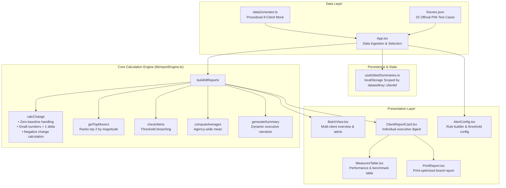

# P06 — Client Reporting Digest Generator

A high-performance web app that auto-generates monthly marketing performance reports for multiple clients, including dynamic written executive summaries, month-over-month change tracking, top-mover ranking, and alert threshold detection.

## Live URL

_(Deploy the `dist/` folder to Vercel/Netlify/Cloudflare Pages and insert your deployed URL here before final submission)_

- **Local Preview**: `npm run build && npm run preview` at `http://localhost:4173`
- **Deploy Command**: `npx vercel --prod` or drag-and-drop `dist/` to Netlify

## Demo Video

- **Walkthrough Asset**: See [demo_walkthrough.webp](public/demo_walkthrough.webp) for an automated visual tour of all 4 MVP features, fixture switching, and mobile responsiveness.
- **Submission Video**: Ensure your 60-second walkthrough video is linked or committed as `demo.mp4` prior to final submission.

## What It Does

1. **Monthly Data** — 8 clients × 5–7 measures with two months of history (last vs current). Switch seamlessly between dynamically generated realistic sample data and all 25 official fixture cases from `public/fixtures.json`.
2. **Per-Client Reports** — Current numbers, month-over-month change with direction indicator, and top two measures that moved the most by magnitude.
3. **Dynamic Summaries** — A narrative executive summary generated from live numbers naming specific measures and exact changes.
4. **Batch View** — All client reports in an actionable grid, with configurable alert thresholds automatically flagging accounts that breach limits.

### Bonus Features

- **Persisted Summary Edits** — Edit executive summaries with changes scoped and saved per dataset (`localStorage`), preventing cross-fixture leakage.
- **Client Branding & Print Mode** — Dedicated print stylesheet with per-client brand color palettes and monogram logos.
- **Benchmark Comparison** — Toggle comparison mode to evaluate individual client measures against the dataset-wide mean.

## System Architecture



## How to Run

```bash
npm install
npm run dev
```

Open `http://localhost:5173`

### Run Automated Tests

The calculation engine includes regression tests protecting all edge cases:

```bash
npm test
```

### Build for Production

```bash
npm run build
npm run preview
```

### Linting

```bash
npm run lint
```

## Data Sources

- **Generated Sample** — Realistic randomized mock data for 8 agency client accounts.
- **Official Test Cases** — 25 official test cases loaded from `public/fixtures.json`. Handled with dedicated loading indicators and error recovery with retry.

## Edge Cases Handled

- **Small starting numbers (< 1)**: Top-mover ranking uses absolute change instead of percentage to avoid disproportionate skew.
- **Zero baseline**: Percentage is omitted (`null`) and absolute delta is shown without division by zero.
- **Negative change**: Direction (`down`) and magnitude calculated accurately for decreases.
- **Dataset isolation**: Summary edits are namespaced by dataset (`datasetKey::clientId`), so edits on PUB-01 never overwrite or leak into PUB-02.
- **Mobile responsiveness**: Complete fluid single-column layout on 375px mobile viewports with no horizontal overflow.
- **Accessible controls**: Full ARIA labeling on all form controls and keyboard button support (both Space and Enter).

## Tech Stack & Licensing

- **React 19** + **TypeScript**
- **Vite 7** (100% MIT-licensed toolchain; zero copyleft or MPL-2.0 dependencies)
- **Vanilla CSS** with CSS Custom Properties and dark aesthetic design system
- See [LICENSES.md](LICENSES.md) for full licensing verification.

## Team

LofiStack Hackathon 2026 — Problem P06 (Team ID: `LSH26-T023`)
