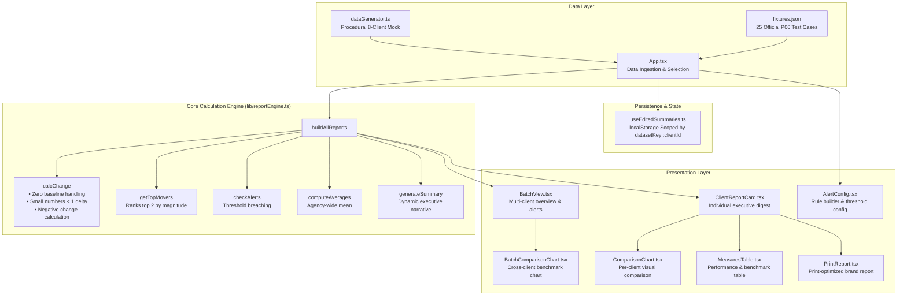

# P06 — Client Reporting Digest Generator

A high-performance web app that auto-generates monthly marketing performance reports for multiple clients, including dynamic written executive summaries, month-over-month change tracking, top-mover ranking, and alert threshold detection.

## Live URL

- **Production URL**: [https://storied-malabi-cb55e5.netlify.app](https://storied-malabi-cb55e5.netlify.app)
- **Local Preview**: `npm run build && npm run preview` at `http://localhost:4173`

## Demo Video

- **Walkthrough Assets**:
  - [demo_walkthrough.webp](public/demo_walkthrough.webp): Full flow recording covering all 4 MVP features, fixture switching, and mobile layout.
  - [charts_walkthrough.webp](public/charts_walkthrough.webp): Interactive demonstration of Cross-Client Benchmark Chart and Per-Client Visual Comparison Chart.
- **Submission Video**: Ensure your 60-second walkthrough video is linked or committed as `demo.mp4` prior to final submission.

## What It Does

1. **Monthly Data** — 8 clients × 5–7 measures with two months of history (last vs current). Switch seamlessly between dynamically generated realistic sample data and all 25 official fixture cases from `public/fixtures.json`.
2. **Per-Client Reports** — Current numbers, month-over-month change with direction indicator, and top two measures that moved the most by magnitude.
3. **Dynamic Summaries** — A narrative executive summary generated from live numbers naming specific measures and exact changes.
4. **Batch View** — All client reports in an actionable grid, with configurable alert thresholds automatically flagging accounts that breach limits.

### Bonus Features

- **Persisted Summary Edits** — Edit executive summaries with changes scoped and saved per dataset (`localStorage`), preventing cross-fixture leakage.
- **Client Branding & Print Mode** — Dedicated print stylesheet with per-client brand color palettes and monogram logos.
- **Benchmark Comparison** — Toggle comparison mode to evaluate individual client measures against the dataset-wide mean.
- **Interactive Comparison Charts** — Cross-client metric benchmark bar chart with dynamic metric switcher, plus dual-mode per-client performance and agency-average visual comparison bars.

## System Architecture



## How to Run

```bash
npm install
npm run dev
```

Open `http://localhost:5173`

### Run Automated Tests

The calculation engine includes regression tests protecting all edge cases:

```bash
npm test
```

### Build for Production

```bash
npm run build
npm run preview
```

### Linting

```bash
npm run lint
```

## Data Sources

- **Generated Sample** — Realistic randomized mock data for 8 agency client accounts.
- **Official Test Cases** — 25 official test cases loaded from `public/fixtures.json`. Handled with dedicated loading indicators and error recovery with retry.

## Edge Cases Handled

- **Small starting numbers (< 1)**: Top-mover ranking uses absolute change instead of percentage to avoid disproportionate skew.
- **Zero baseline**: Percentage is omitted (`null`) and absolute delta is shown without division by zero.
- **Negative change**: Direction (`down`) and magnitude calculated accurately for decreases.
- **Dataset isolation**: Summary edits are namespaced by dataset (`datasetKey::clientId`), so edits on PUB-01 never overwrite or leak into PUB-02.
- **Mobile responsiveness**: Complete fluid single-column layout on 375px mobile viewports with no horizontal overflow.
- **Accessible controls**: Full ARIA labeling on all form controls and keyboard button support (both Space and Enter).

## Tech Stack & Licensing

- **React 19** + **TypeScript**
- **Vite 7** (100% MIT-licensed toolchain; zero copyleft or MPL-2.0 dependencies)
- **Vanilla CSS** with CSS Custom Properties and dark aesthetic design system
- See [LICENSES.md](LICENSES.md) for full licensing verification.

## Requirement Proof

| Requirement | Description | Status | Verification & Evidence |
|---|---|---|---|
| **R1** | 8 clients × 5–7 measures with two months of history (last vs current) | Complete | [dataGenerator.ts](src/lib/dataGenerator.ts), [fixtures.json](public/fixtures.json), [App.tsx](src/App.tsx) |
| **R2** | Per-client reports: current numbers, MoM change, direction, top 2 movers | Complete | [ClientReportCard.tsx](src/components/ClientReportCard.tsx), [reportEngine.ts](src/lib/reportEngine.ts#L62-L80) |
| **R3** | Dynamic natural language executive summary naming exact measures and changes | Complete | [reportEngine.ts:generateSummary](src/lib/reportEngine.ts#L104-L125), [ClientReportCard.tsx](src/components/ClientReportCard.tsx) |
| **R4** | Batch view showing all client reports with configurable alert thresholds | Complete | [BatchView.tsx](src/components/BatchView.tsx), [AlertConfig.tsx](src/components/AlertConfig.tsx), [reportEngine.ts:checkAlerts](src/lib/reportEngine.ts#L82-L95) |

## Problem-Solving Method & Member Contributions

### Method Statement
The team approached P06 by isolating business logic into a pure, deterministic calculation engine covering edge cases (zero baseline, small numbers <1, negative deltas) protected by automated unit tests, accompanied by an accessible dark-mode UI, interactive comparison charts, and localStorage-persisted executive briefings scoped by dataset.

### Registered Member Contributions
- **Arijit Paul** (`arijit547`): End-to-end architecture, report calculation engine, feature implementation, and comparison chart visualization.
- **Teammate**: Codebase debugging, test case verification, calculation edge-case QA, and live deployment validation.

## Major Design Decisions

1. **Deterministic Calculation Core**: `src/lib/reportEngine.ts` is implemented with zero browser or React dependencies, allowing instant automated unit testing via `node --test`.
2. **Strict Permissive Licensing**: Downgraded to Vite 7.3.6 and avoided external charting libraries to eliminate MPL-2.0 and copyleft dependencies.
3. **Namespaced Storage Persistence**: Executive summary edits are stored in `localStorage` keyed by `${datasetKey}::${clientId}` to completely prevent cross-fixture data leakage.
4. **Accessible Dual-Chart Visualization**: Custom SVG/CSS bar charts provide both cross-client metric benchmarking and per-client MoM/agency-average comparisons.

## Known Limitations

1. **Local Storage Only**: Summary edits persist in browser `localStorage`; multi-user cloud synchronization is not included.
2. **Browser Print Export**: Export relies on the browser's native print engine styled via CSS `@media print`; direct server-side PDF generation is a future enhancement.

## Team

- **Team ID:** `LSH26-T023`
- **Problem ID:** `P06`
- **Repository:** `lsh26-t023-p06`

